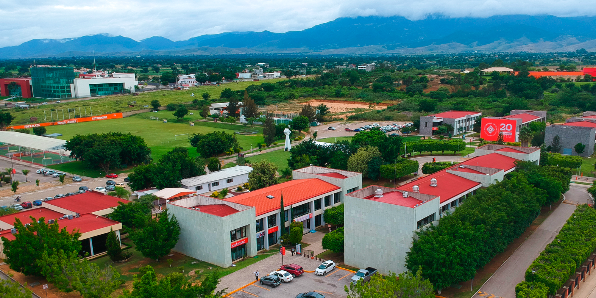
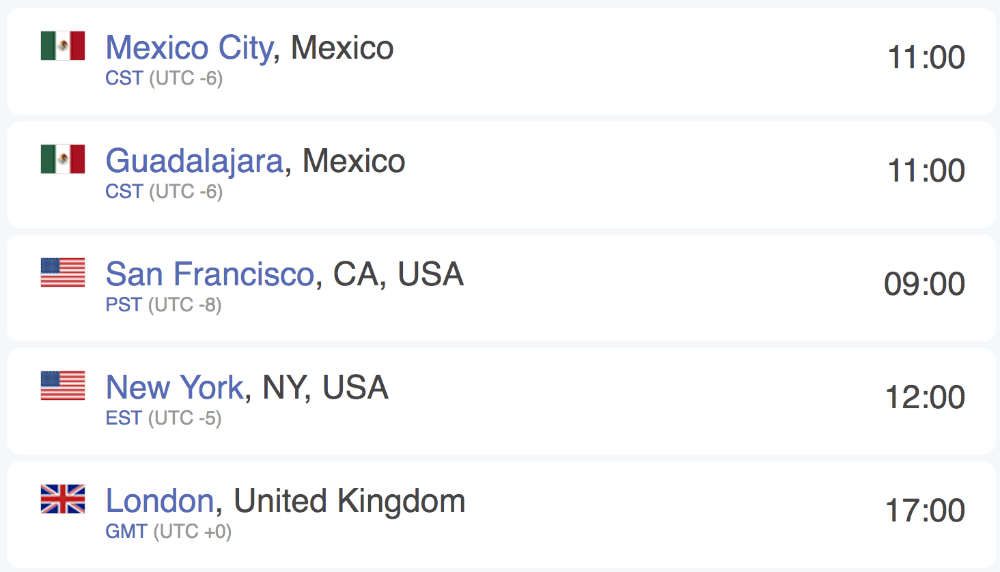
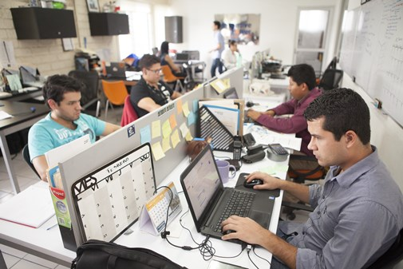

# Why Nearshore in Mexico?

## Table of Contents

1. [What to know about Mexico?](#what-to-know-about-mexico)
1. [An overview of outsourcing software development to Mexico](#an-overview-of-outsourcing-software-development-to-mexico)
1. [Advantages of outsourcing software development to Mexico](#advantages-of-outsourcing-software-development-to-mexico)
1. [What to watch out for when working with Mexican engineers?](#what-to-watch-out-for-when-working-with-mexican-engineers)
1. [Disadvantages of distance outsourcing](#disadvantages-of-distance-outsourcing)
1. [The cost of hiring remote developers from Mexico](#the-cost-of-hiring-remote-developers-from-mexico)
1. [Remote Mexican developers engagement types](#remote-mexican-developers-engagement-types)
1. [Outsourcing software development to Mexico: FAQ](#outsourcing-software-development-to-mexico-faq)
1. [Key Takeaways](#key-takeaways)

## What to know about Mexico?

- Capital: Mexico City
- Currency: Mexican Peso (MXN)
- Language: Spanish
- Timezone: GMT-6
- Population: 127,600,000
- A number of developers: 700,000+
- Average developer’s salary: $51,247 ⁽*¹⁾
- Business Climate: A4 ⁽*²⁾
- Risk Assessment: B ⁽*³⁾
- Political Stability: -0.6 ⁽*⁴⁾
- Ease of doing business: 72.4 ⁽*⁵⁾

⁽*¹⁾ according to Glassdoor, Senior Software Engineer, 7-9 years of experience.

⁽*²⁾ according to Coface. It includes the ease of running a business, the political situation in the country, and whether the legal system provides fair conditions and business protection for companies. Rating scales: A1, A2, A3, A4, B, C, D, and E.

⁽*³⁾ according to Coface. It refers to the country’s ability to transfer currency for foreign payments. Rating scales: A1, A2, A3, A4, B, C, D, and E.

⁽*⁴⁾ according to The World Bank. These statistics show the political stability and absence of violence. It ranges from -2.5 (lowest) to 2.5 (highest).

⁽*⁵⁾ according to The World Bank Doing Business 2020 report.

## An overview of outsourcing software development to Mexico

Mexico has become a popular choice that sets itself apart from other outsourcing software development companies with its top talent and convenient location. This country is no longer a hidden gem for software development outsourcing or nearshoring, given its proximity to America. As an outsource partner, Mexico benefits from a strong tech sector labor force, competitive wages, mature infrastructure, and the advantage of geography.

For companies working with outsourced teams, software development outsourcing to Mexico makes a lot of sense. Unlike India, where there is a 10 to 12-hour time difference, Mexico is in the same time zone, or close enough, depending on where you are. Working on agile development projects can be an enormous advantage to having real-time communication with your remote software development team.

Around the world, demand for high-quality talent in the tech sector still outstrips supply. Supply and demand mean developers, especially those in developed economies such as the United States, can command high salary exceptions. Thus, having an in-house development team can be extremely expensive in North America and Western Europe.

Governments and the education sector is moving quickly to solve the talent shortage. Since 2006, Mexico—compared to other Latin American countries—has taken the lead in training a new generation of science, technology, engineering, and mathematics (STEM) graduates. For USA companies looking for nearshore software development, Mexico could be the solution you’ve been looking for.

In 2022, Mexico became #58 among the Top Digital Nations worldwide according to the Global Innovation Index 2022 and the top-3 country from the LatAm region.

## Advantages of outsourcing software development to Mexico

Mexico is committed to solving the technology talent shortage. Between 2006 and 2012, Mexico opened 120 specialist technology tuition-free universities and expanded 96 schools and colleges to accommodate science and engineering courses. The country is committed to ensuring that the IT industry is up to the highest standard and can satisfy clients worldwide.

### 1. Tech talent in Mexico

A few years after this significant push on education, Mexico produced nearly as many STEM graduates as America. As the 2022 STEM Education Report noted , from 2010 to 2021, the interest of students in STEM increased from 25% to 35%. Regarding computer sciences, Mexico is among the top countries globally, graduating over  130,000 graduates each year. Mexico now stands proudly alongside other Organisation for Economic Co-operation and Development (OECD) countries to produce technology and computing graduates.

Former U.S. President Bill Clinton notes that “All we read about is the violence and the drug war. The truth is that the previous president [President Felipe Calderon] built 140 tuition-free universities. The Mexicans produced 113,000 software engineers. We produced 120,000. They’ve had very brisk growth.”

One such powerhouse of this growth is The Instituto Tecnológico y de Estudios Superiores de Monterrey (ITESM), with 30 campuses in 25 cities. ITESM is so well known for producing top talent, with numerous links to the industry. Heinz College of Information Systems and Public Policy at Carnegie Mellon University has partnered with them on a joint master’s in software engineering management.

In high schools across Mexico, STEM subjects are increasingly popular. Numerous private, local, government, and nonprofit-led initiatives, such as Code GDL, encourage school children to learn CSS, Java, and other languages at an early age.

Mexico is making a great effort to create a talent pipeline from school onwards that can support a strong and diverse tech sector and meet the needs of technology partners, clients, and employers in the U.S.

Source: _Webpage Anahuac University Campus Oaxaca_

### 2. Mature infrastructure of Mexican IT sector

In recent years, the Mexican government and private developers have invested heavily in business and technology parks and are actively working on transforming the country into the creative digital hub of Latin America.

Since 2013, the following parks have been opened with facilities and offices comparable to any U.S. business park: Monterrey Technology Park, Apodaca Technology Park, and Guadalajara Software Center. Ongoing public and private investment in office parks and workspaces for tech companies are increasing as the demand for talent continues to grow.

Guadalajara is part of Mexico’s “Silicon Valley,” with a thriving tech workforce of 115,000. Some companies are no longer content to outsource at a distance: Oracle, Amazon, and other tech giants are busy recruiting local talent and expanding operations in Mexico. We expect that to continue over the next few years. Competition for software engineers, developers, and those with specialist skills, such as machine learning and cybersecurity, is increasing, with more graduates flooding the jobs market with those much-needed skills.

Mexico’s infrastructure, talent pool, and technology parks are attracting more international brands looking to outsource offshore or employ IT teams directly. More startups and software companies are forming in Guadalajara and around the country.

Consequently, a talent pool is drawn to work for outsourcing software development firms that can offer U.S.-style workplaces and office perks. It’s also worth noting that co-working spaces are more popular in big cities, with WeWork and competitors opening dozens of sites across Mexico in recent years.

However, we should address the image problem that Mexico has. The Mexico that gets media attention and Mexico for most of the population and those who outsource work to local suppliers and partners are two different things. As President Clinton said, we hear about violence and drug gangs. We don’t hear about millions of skilled developers working on amazing projects for local and international companies.

Under the Trump administration, it was increasingly difficult for Mexicans to obtain skilled worker visas, known as H-1B. But for many, this is turning out to be a blessing in disguise, with a thriving tech sector eager to hire those who would otherwise have moved to the U.S.

It’s true that drug gang violence in some regions—nowhere near the technology parks—often makes the headlines in the U.S. However, for the most part, the Mexican government is stable and pro-business, with a stable and strong economy.

Source: _[www.coworker.com](https://www.coworker.com/mexico/oaxaca/centrico-coworking)_

### 3. Real-time collaboration between Mexico and the rest of the Americas

Nearshore software development in Mexico is far easier than working with an outsourcing team in India, China, Indonesia, or anywhere else in Asia. It is in or near most U.S. time zones. Close enough for everyone on both sides of an email, Skype, Slack, Telegram, or whatever collaboration tool you prefer to engage in real-time calls and exchanges.

Flying to Mexico from the U.S. isn’t a huge ordeal either. With over 300 flights daily, you can meet in person, or a nearshore outsourcing partner can fly up and meet your team. Compared to India, where flying time can take up to 30 hours (depending on where you’re flying to and from), it takes less than 6 hours from most mainland U.S. airports.

Communicating with an outsource software development team in India incurs a 10-12 hour gap, which means you often won’t get a response or any action taken until the next working day, even with the most attentive outsourcing partner. The language barrier isn’t a problem either. English is widely spoken, especially amongst degree-educated computer science and engineering graduates. It is the international language of business and an invaluable skill that is encouraged in Mexican workplaces and, of course, when communicating with clients. Spanish is also widely spoken, which can also be an advantage.

Source: _CCSI_

### 4. Low staff attrition in Mexican outsourcing companies

In regions such as India or Eastern Europe, competition for talent amongst international firms and those who work for international clients is fierce. Of course, as Mexico gains more exposure to the international outsourcing market, we can expect more competition for talent. However, for the most part, retention rates are much higher.

For clients in the U.S., this is an advantage. It means you should start and finish a project with the same lead developer. The knowledge and talent that worked on a project should stay in the company you worked with, which means any new recruits can benefit from the retained knowledge and experience. When staff turnover is high, companies lose a lot more than the outputs of those who went to work for another firm. Institutional knowledge is lost, as are technical solutions to difficult challenges, which will impact projects software firms are working on for clients.

It also means you should receive ongoing support—depending on the contract terms—from the same team. The reasons to invest in outsourcing software development to Mexico are near real-time communication, a professional, hardworking attitude, a commitment to results, and high staff retention rates. It shows that most Mexican software companies are working hard to recruit, retain, train, and look after staff, their talent pool, and clients.

### 5. Professional service delivery

As we’ve mentioned, Mexican software and IT partners take service delivery seriously.

Mexico wasn’t always thought of as a mature and reliable partner. It is not in the same way as Canada, India, or China, and it still has some catching up from an image perspective. It was, until recently, a destination for cheap labor investments and outsourcing. And in some industries, that is still the case.

However, in technology, software development, help desks, and more complex solutions, such as cyber-security and machine learning, Mexico is increasingly seen as a go-to destination for American businesses. When working with outsourcing companies in Mexico, you should expect the same level of professionalism you can get at home. Agree on timescales, deliverables, and processes.

Have a clear process to ensure a project stays on schedule and on budget, with responsible parties in both teams to coordinate efforts and keep the lines of communication open. As is the case with any outsource project, ensuring both sides listen to one another, ask the right questions, and work with transparency is key to delivering successful outcomes. One of the advantages of the [COATI Tech](https://agomezguru.github.io/cti-tech) marketplace is that you get to pick the development team working on the project, giving you transparency and greater trust in what will be delivered from the initial conversation to completion.

### 6. Cost advantages of software development outsourcing to Mexico

And finally, when it comes to the advantages of software development outsourcing to Mexico, we can’t deny that labor cost is an attractive factor for companies looking to scale without absorbing the higher salaries recruiting the same skills in America.

In Mexico, the average salary of a software engineer [is usually around](https://www.glassdoor.com/Salaries/mexico-software-developer-salary-SRCH_IL.0,6_IN169_KO7,25.htm) MXN 1,290,972 (USD 67,716) per year. In contrast, [the average US developer earns](https://www.glassdoor.com/Salaries/us-software-developer-salary-SRCH_IL.0,2_IN1_KO3,21.htm) USD 146,665, which shows that there is a significant cost difference for the same skills. Even in tier-II cities, software developers can command high salary expectations due to demand and a chronic shortage of suitable talent.

Salary costs aside, the cost of coordinating projects with Mexican teams is significantly cheaper than you will find when working with outsourcing partners in other parts of the world. With near real-time collaboration, it reduces the risk of misunderstandings, work being done that wasn’t needed, or mistakes that can occur when requests for changes aren’t delivered on time and as needed.

Lower salaries—and therefore hour/project rates—and a vibrant and strong labor force mean that you can access the talent, skills, and experience you need to create mission-critical technology projects with none of the downsides of outsourcing further afield.

## What to watch out for when working with Mexican engineers?

Of course, outsourcing has its downsides. Before committing to a project, make sure to check the following:

- Ask for examples and case studies/testimonials (verification is highly important, especially since you get to speak to the developers you want to work with before engaging with the firm they work for);
- Get someone technical to review the work (especially if you are going to integrate a new technical project with your systems, software or tech stack);
- Agree on timescales, project milestones, and other business processes involved

If you are happy to go ahead, then as is the case with any outsourced project, it’s important to maintain the following processes:

- Regular communication. Keep in close contact with the project lead and other members of the team as much as needed to ensure your needs are communicated to them;
- Have someone on your side, such as a CTO or onshore project manager, oversee the work. Leaving this to a non-technical team member could result in costly mistakes and misunderstandings down the road;
- Make sure milestones are hit or any delays on either side are fully explained and understood

Whether you are working with developers in Mexico, Brazil, Canada, India, or Ukraine, these challenges are the same for outsourcing the world over. As we’ve outlined in this article, Mexico comes with numerous advantages, which is why outsourcing to Mexico has become such a popular choice for U.S. companies with tech projects that need a reliable partner to deliver the work.

At the same time, in recent years, India has fallen out of favor as an outsourcing partner. Let’s take a look at why.

Source: _OZY_

## Disadvantages of distance outsourcing

Firstly, before we look at why India is no longer number one for software outsourcing, what about other Latin American countries?

Countries such as [Costa Rica](https://youteam.io/blog/software-development-outsourcing-to-costa-rica/), [Colombia](https://youteam.io/blog/6-reasons-for-outsourcing-software-development-to-colombia/), and [Argentina](https://youteam.io/blog/software-development-outsourcing-to-argentina/): are worth exploring as an option? Yes, they are. However, Mexico is clearly ahead of the pack when it comes to a market leader for talent.

Mexico has the infrastructure, and it has invested in education and talent development. Although being more expensive than other [Latin American countries](https://youteam.io/blog/offshore-software-development-in-latin-america/), it’s known as a reliable outsourcing partner trusted by more U.S. companies than any other. All of these are reasons why it is overtaking India as the outsourcing destination for web development.

One of the advantages of “Brand India” has always been the IT sector. And yet, in recent years, that brand has suffered. Not only is the time difference proving a challenge for many U.S. companies, but there are a talent shortage and higher attrition rates of staff in that sector. One of the fourth largest Indian IT companies—listed on the New York Stock Exchange—Satyam, went through a high-profile meltdown that caused many to lose confidence in IT outsourcing to India.

Another unfortunate disadvantage is the danger of violence. Although in the U.S. media, we hear a lot about gun violence and powerful gangs, those social problems are mainly concentrated in border cities (Juarez, Nuevo Laredo, Nogales), far from the IT and technology centers.

According to a more recent [Economist Intelligence Unit safest cities report](https://www.eiu.com/n/campaigns/global-liveability-index-2022), there were no Mexican cities amongst the ten most unsafe places in the world.

## The cost of hiring remote developers from Mexico

Software developers’ rates always range depending on the location, the experience, and the tech and soft skills of each engineer. Down below, you can find the list of average developers’ salaries depending on the technology they are skilled at and the seniority of the engineer.

### Salary range between junior, middle, senior, and lead developer in Mexico

We have analyzed local Mexican job boards and different salary statistics to find out the developers’ rates due to their seniority. A junior software engineer with less than 1 year of experience can expect to earn MXN 696,000 (USD 36,507). After 1-4 years of experience, a middle engineer earns an average total compensation of MXN 960,000 (USD 50,355), while a senior specialist with 5-9 years of experience earns MXN 1,290,972 (USD 67,716). If you need to hire an experienced architect or a team lead, an average total compensation would be MXN 1,316,628 (USD 69,062).

This is an average salary that doesn’t include tips, bonuses, and overtime pay.

### Salary range depending on software development technology

Depending on the technical skills and technology stack that a developer specializes in, their rates can differ a lot. We have gathered information from different resources to provide you with quality and the most recent data. In the table below, you will find the information from the sources:

- Developers’ salary data from [PayScale](https://www.payscale.com/) to compare the difference in rates between Mexico and the US.
- COATI Tech network with a database of 10+ vetted software engineers from top outsourcing partners.

Below you can find the spreadsheet with software developers’ salaries per year, which vary due to the technology and the country and compare them to the rates we offer at COATI Tech.

You can see a difference in average salaries in Mexico, the USA, and the YouTeam network. It is defined by the fact that the developer’s salaries do not include taxes, bonuses, and any additional expenses you will have after hiring a developer. On job boards, you can see the salary that companies offer developers for their work. When you work with an outsourcing partner, the companies offer higher rates because they pay taxes, and bonuses and cover all additional expenses for their development teams. As a rule, on job boards, you can find freelance software engineers with the mentioned rates, but when you work with a reliable partner, it will cost you more.

Meanwhile, COATI Tech provides clients with a network of 50,000+ vetted engineers from hundreds of development agencies. The salary in that column means the money you pay to your outsourcing partner for a quality software developer from Mexico.

| |Mexican developers’ salary on local job boards* | US developers’ salary for comparison | Mexican developers’ rates on COATI Tech |
|---|:-:|:-:|:-:|
| [NodeJS](https://youteam.io/blog/hiring-a-node-js-developer/) | USD 43,400 | USD 138,290 | USD $$$$ |
| [AngularJS](https://youteam.io/blog/hiring-angularjs-developer/) | USD 51,241 | USD 153,016 | USD $$$$ |
| [JavaScript](https://youteam.io/blog/fact-sheet-to-learn-before-hiring-a-javascript-developer/) | USD 49,424 | USD 169,407 | USD $$$$ |
| [PHP](https://youteam.io/blog/hire-php-developer-comprehensive-guide/) | USD 35,537 | USD 145,546 | USD $$$$ |
| [ReactJS](https://youteam.io/blog/hiring-senior-react-developer/) | USD 71,628 | USD 188,500 | USD $$$$ |
| [.Net](https://youteam.io/blog/a-complete-guide-on-hiring-net-software-developers/) | USD 40,391 | USD 156,426 | USD $$$$ |

_*In the first column, you can see the basic level of Mexican developers’ average salary. This salary relates more to hiring in-house engineers in Mexico to join your team in the office and it does not include any taxes and benefits._

### Hourly salary rates to hire senior developers from Mexico

In the spreadsheet above, you can find an overview of average salary rates in Mexico to give you an understanding of the market and how much it can cost to hire an engineer in this country. However, if you are looking for quality tech talent and want to hire a senior developer, we have prepared a comparison of the hourly rates salary of senior software engineers.

In the first column, we have provided hourly rates of US senior developers based on Glassdoor and Indeed data. In the second one, you can find rates from Mexican vendors we offer on the YouTeam platform if you choose staff augmentation.

| | US | Mexico, COATI Tech |
|---|:-:|:-:|
| Senior NodeJS developer | USD 72 | USD 57 |
| Senior AngularJS developer | USD 80 | USD 56 |
| Senior JavaScript developer | USD 88 | USD 61 |
| Senior PHP developer | USD 76 | USD 55 |
| Senior ReactJS developer | USD 98 | USD 58 |
| Senior .Net developer | USD 79 | USD 56 |

## Remote Mexican developers engagement types

### What you need to know to hire a Mexican developer in-house

The first and the main law that you need to know when employing engineers in Mexico is the Federal Labor Law (Mexican Constitution, 1917) which regulates the main aspects of the working relationship between employer and employee. These relationships (working terms and conditions) also have to be officially confirmed with a written employment contract.

Below are some legal fundamentals of hiring developers in Mexico.

__Working hours:__ maximum 48 hours/week, 8 hours per day.
__National holidays:__ 8 per year.

__Taxes:__ employer—25% of employee salary, 5% to the National Housing Fund for Workers; employee (individual income tax)—up to 35%.

__Bonuses:__ National Christmas bonus (annually on Dec, 20) equivalent to 15 days of regular wages.

__Social security:__ health coverage—partly contributed by both employers and employees; retirement pensions; disability compensation; unemployment payments, etc.

__Vacations:__ after 1 year of employment—6 days of paid leave; 2 years—8 days, 3 years—10 days, 4 years—12 days, 5+ years of employment—x2.

__Leaves:__ sick leave is paid in the amount of 60% of an employee’s regular wage; maternity leave (42 calendar days prior to birth, and 42 calendar days after childbirth) is paid by the state; paternity leave (5 business days) is paid by the company.

__Probationary period:__ 30-day trial period for contracts over 180 days

__Termination fee:__ up to 1 year in a company—3 months’ salary, each additional year + 20 days.

### Where to find in-house developers from Mexico

Here is a list of top job boards to look for Mexican developers directly. There you can look through engineers’ CVs or post your job and wait for applicants:

- [OCCMundial](https://www.occ.com.mx/) – 4 million visitors with around 80,000 job offers
- [Bumeran](https://www.bumeran.com.mx/) – about 1,950,000 active applicants with more than 6000 companies registered under them
- [CompuTrabajo](https://www.computrabajo.com.mx/) – 10,771 companies hiring and around 73,645 job vacancies

### What you need to know to hire a contractual Mexican developer

According to the Federal Labor Law, a contractor doesn’t subordinate to an employer the way an employee should. That’s one of the main differences in work relationship organization.

A contractor has the freedom to choose working hours, and place of work. They are obliged to pay income taxes. And the services they provide should include a 16% VAT.

Individual contractors don’t receive any benefits or social security that are obliged to in-house employees. This is a loophole used by many companies who work with practically — “employees” who formally are “independent contractors”. But according to the FLL, companies can receive big fines for this type of work organization.

Another way to hire contractors from Mexico is to use the services of outstaffing companies that are the employer of record and take care of all legal aspects of the hiring process. However, this hiring process usually takes a lot of time—there are many dev shops, but not all of them would be ready to offer the needed software engineers with the required skills.

A similar option that doesn’t have such cons is to try YouTeam–the #1 solution for rapid engineering staff augmentation. Thanks to the network of 50,000 pre-vetted engineers, YouTeam is not only able to source candidates many times faster than any outsourcing agency–but also provides access to talent of much better quality.

## Outsourcing software development to Mexico: FAQ

### Is Mexico a smart choice for nearshore software development outsourcing?

Latin American countries are becoming technological hubs of innovation and software development production at an increasing rate. Mexico, in particular, stands out among the other countries in the region because of its rapidly growing infrastructure, the amount and quality of tech talent, and affordable rates. The Mexican government and private developers are making a great effort to develop the IT industry in the country further. Thus, software development outsourcing to Mexico is not only smart and cost-efficient but also farsighted.

### How much does it cost to hire a developer in Latin America?

The average hourly rate for software development in Latin America is $55. However, this price will vary from country to country. For instance, Mexico and Argentina have the highest hourly rate in the region—$68, while in Bolivia and Peru, you can hire a software engineer for $37-52 per hour. You may find our research on the rates of offshore developers in each country [in this article[(https://youteam.io/blog/offshore-developers-rates-in-2020-best-countries-and-best-platforms-to-hire-a-remote-development-team/)].

### How to vet offshore developers when hiring remotely?

Vetting offshore developers is an essential part of the hiring process as it helps to evaluate the hard skills of a developer and decide if you can proceed further. Today, many online coding interview tools can take the unnecessary hassle out of the process and make remote hiring less problematic. In [our blog post](https://youteam.io/blog/how-to-vet-tech-candidates-especially-when-hiring-remotely-best-practices-in-2020/) about vetting tech specialists, we have collected the top coding assessment test platforms of 2022 to help you hire the best offshore developers in the market.

## Key Takeaways

Mexico is a safe, secure, and reliable software development partner. With the advantage of a competitive and strong labor force that can work with your team in real-time, delivering what you need without the higher costs of recruiting a team of developers in the U.S. As an outsourcing solution, it is an option well worth exploring.

Some of the most important advantages of software development outsourcing to Mexico:

- __Talent:__ Huge investments in high school and university education are producing 130,000+ technology graduates every year.
- __Infrastructure:__ A strong commitment to technology and business parks is attracting local and international companies. Mexico also benefits from a mature infrastructure and over 300 flights from the U.S. daily.
- __Collaboration:__ Real-time communication is possible from every U.S. state, making it easier to work with remote teams.
- __Low rates of staff attrition:__ Software companies look after staff, which means you benefit from working with the same teams on a project from start to finish.  
- __Professional service delivery:__ Benefit from and expect the same high standards of professional service in Mexico that you get in the U.S.
- __Cost advantages:__ Competitive costs make it easier to scale a large team quickly, giving you much greater value for money in Mexico.
